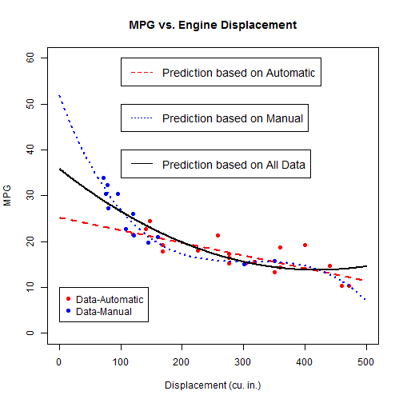

## About the Shiny App

The app revisits the mtcars data set where the user can find the predicted
values of MPG for a given engine displacement in cubic inches.

The predictions are based on three possible models based on subsets of the
data and the entire data set.

---

## About the Data Set

The mtcars data set contains 32 observations for 1973-74 models of cars 
from Motor Trend magazine.  The fuel consumption (MPG = miles/gallon) 
along with 10 other variables are part of this data set.

---

## Data Subsets

Many variables can contribute to fuel consumption, but this app focuses only
on transmission type.  As a result, three prediction models are considered:

>1. Automatic Transmission Only using a linear model fit
>2. Manual Transmission Only using a 3rd order polynomial fit
>3. All Data using a 2nd order polynomial fit

---

## Prediction Models

App identifies user defined point(s) on curve(s).
